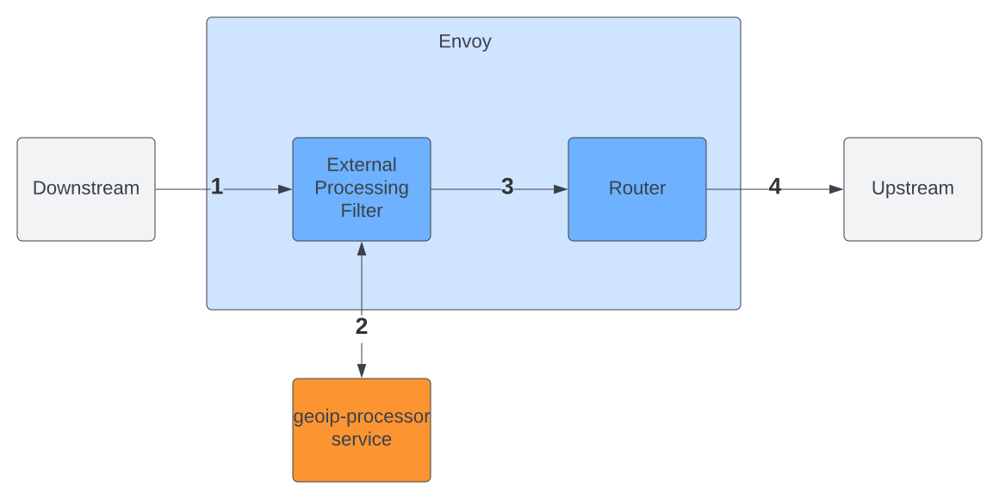

# geoip-processor
External Processor for Envoy that Adds GeoIP Data to HTTP Traffic.  This service can be connected to Envoy via the 
[External Processing](https://www.envoyproxy.io/docs/envoy/latest/configuration/http/http_filters/ext_proc_filter) HTTP 
filter to inspect incoming requests and add GeoIP data (ie `X-Country-Code`) for use by upstream services.

# Flow


1. Incoming request from downstream is intercepted by External Processing filter.
2. GRPC bidirectional stream opened to GeoIP external processor service.  External processor uses Maxmind reader to lookup geoip data of request IP and responds with header mutation that appends geoip data to request headers.
3. Envoy continues to process request down filter chain.
4. Router filter routes request to correct upstream.

## TODO
* Allow customization of request header that source IP is extracted from.  Currently, limited to first IP in XFF header.
* Allow customization of request header geoip data is injected into.  Currently, limited to `x-country-code`.
* Allow customization of geoip data that is resolved.  Currently, limited to Country Code of source IP.

## Testing
In order to test this, you must have the MaxMind [GeoLite2](http://dev.maxmind.com/geoip/geoip2/geolite2/) or 
[GeoIP2](http://www.maxmind.com/en/geolocation_landing) database present locally.

The external processor can either be tested directly via `grpcurl` or by running Envoy with the included configuration. 
In either case, including the `X-Forwarded-For` header in the request should cause the processor to modify the request 
headers to include an `X-Country-Code` header with a value of the country code that the IP is registered in.

```shell
$ export GEOIP_DB=<Path to MaxMind mmdb>

# bring up external processor service, Envoy and httpbin
$ docker-compose up -d

# test the external processor directly
$ grpcurl -plaintext -d '{"async_mode": false, "request_headers": {"headers": {"headers": [{"key": "x-forwarded-for", "value": "8.8.8.8"}]}}}' 127.0.0.1:8000 envoy.service.ext_proc.v3.ExternalProcessor/Process
{
  "requestHeaders": {
    "response": {
      "headerMutation": {
        "setHeaders": [
          {
            "header": {
              "key": "x-country-code",
              "value": "US"
            }
          }
        ]
      }
    }
  }
}

# test via httpbin. Spoof IP by manually setting XFF header and note x-country-code in response
# US IP
$ curl -H "X-Forwarded-For: 8.8.8.8" 127.0.0.1:10000/headers
{
  "headers": {
    "Accept": "*/*",
    "Host": "127.0.0.1:10000",
    "User-Agent": "curl/7.79.1",
    "X-Country-Code": "US",
    "X-Envoy-Expected-Rq-Timeout-Ms": "15000"
  }
}

# Indian IP
$ curl -H "X-Forwarded-For: 3.6.203.25" 127.0.0.1:10000/headers
{
  "headers": {
    "Accept": "*/*",
    "Host": "127.0.0.1:10000",
    "User-Agent": "curl/7.79.1",
    "X-Country-Code": "IN",
    "X-Envoy-Expected-Rq-Timeout-Ms": "15000"
  }
}

# Australian IP
$ curl -H "X-Forwarded-For: 13.210.4.1" 127.0.0.1:10000/headers
{
  "headers": {
    "Accept": "*/*",
    "Host": "127.0.0.1:10000",
    "User-Agent": "curl/7.79.1",
    "X-Country-Code": "AU",
    "X-Envoy-Expected-Rq-Timeout-Ms": "15000"
  }
}
```

